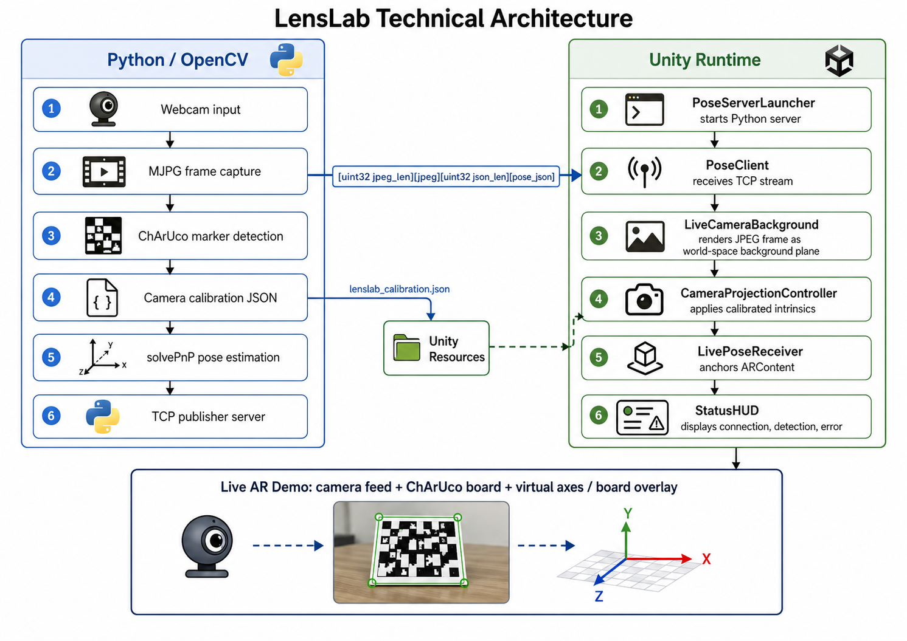
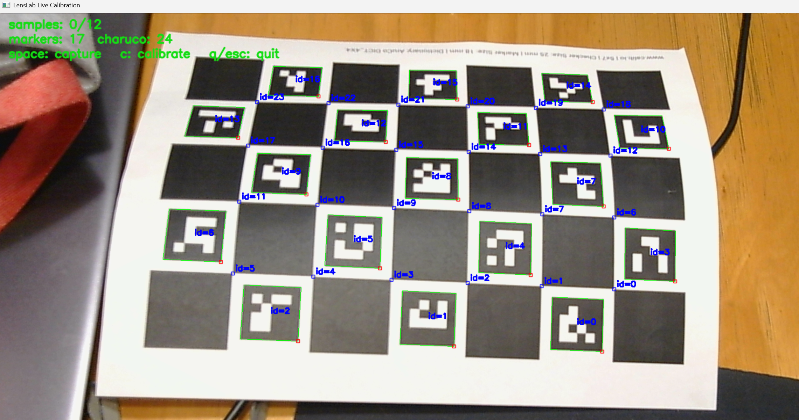
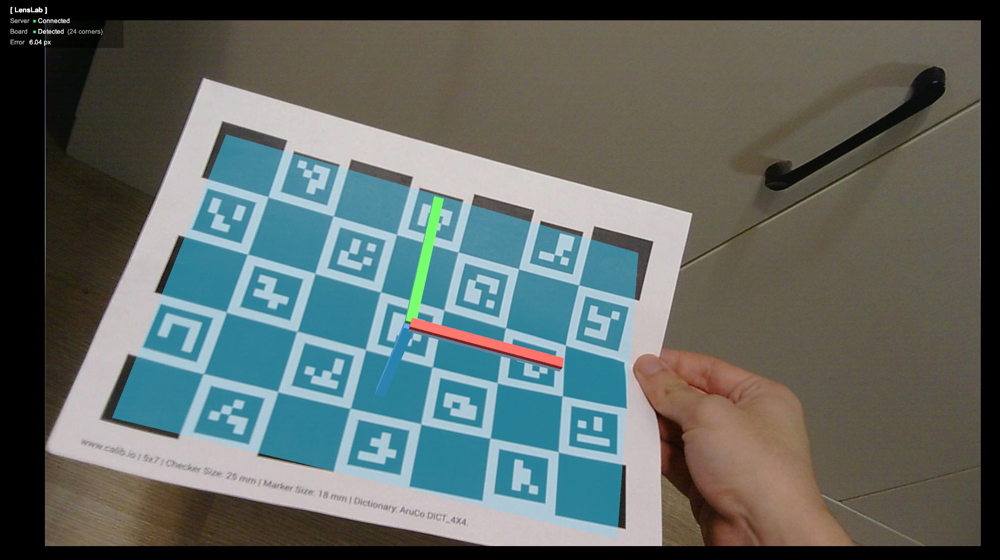
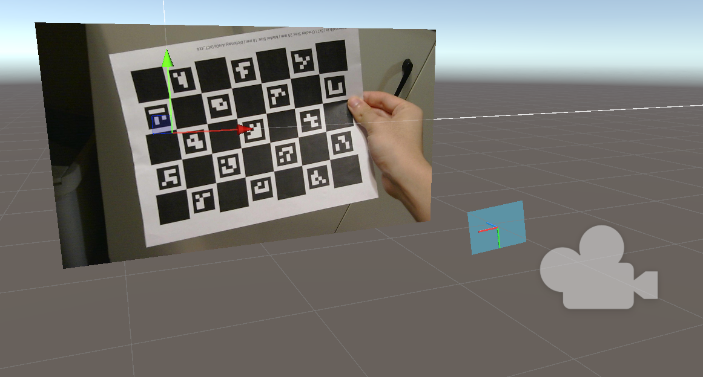

# LensLab

LensLab is a Unity + OpenCV live AR prototype built around a ChArUco target.

The project has two core workflows:

1. **Python live camera calibration**: OpenCV captures ChArUco observations from a real camera and writes shared camera intrinsics to JSON.
2. **Unity TCP AR runtime**: Python owns the webcam, estimates pose in real time, streams `(JPEG frame, pose JSON)` over TCP, and Unity renders virtual content over the live camera feed.

The Unity side can create the complete demo scene from one menu item:

```text
LensLab -> Setup -> Create Live AR Scene
```

After that, press Play. Unity starts the Python pose server, receives camera frames over TCP, shows the live background, and anchors `LensLabARContent` to the detected ChArUco board.

## Preview



**Live calibration**



**Unity AR result**



**Scene setup**



## Environment

Recommended baseline:

- Windows
- Unity 2022.3 LTS
- Python 3.10
- Conda environment named `lenslab`
- A webcam that supports MJPG at the desired runtime resolution

Create the Python environment:

```powershell
conda create -n lenslab python=3.10 numpy scipy pyyaml pip -y
conda run -n lenslab python -m pip install opencv-contrib-python matplotlib
```

The Unity launcher defaults to:

```text
conda run --no-capture-output -n lenslab python -u calibration/scripts/pose_server.py
```

If your environment has a different name, edit `LensLabPoseServerLauncher -> Conda Environment Name` in the Unity Inspector.

## Repository Layout

```text
LensLab/
+-- calibration/
|   +-- configs/
|   |   \-- charuco_board.yaml
|   +-- output/
|   |   \-- camera_calibration.json
|   \-- scripts/
|       +-- calibration/
|       |   +-- calibrate.py
|       |   \-- live.py
|       \-- pose_server.py
+-- unity_project/
|   \-- LensLab/
|       +-- Assets/Plugins/LensLab/
|       |   +-- Editor/
|       |   +-- Resources/
|       |   +-- Runtime/
|       |   \-- Shaders/
|       +-- Packages/
|       \-- ProjectSettings/
\-- README.md
```

## Live Camera Calibration

Print or display the ChArUco board described by:

```text
calibration/configs/charuco_board.yaml
```

Run live calibration:

```powershell
conda run -n lenslab python calibration/scripts/calibration/calibrate.py live --camera-index 0 --width 1920 --height 1080 --save-frames
```

Controls in the OpenCV preview:

- `space`: accept the current stable ChArUco frame
- `c`: calibrate from accepted frames and write JSON
- `q` or `esc`: quit

Output:

```text
calibration/output/camera_calibration.json
```

Copy or sync that JSON into Unity Resources when calibration changes:

```text
unity_project/LensLab/Assets/Plugins/LensLab/Resources/LensLab/lenslab_calibration.json
```

The runtime works best when calibration and runtime capture use the same resolution.

## Unity Live AR Demo

Open:

```text
unity_project/LensLab
```

In Unity:

1. Open or create an empty scene.
2. Run `LensLab -> Setup -> Create Live AR Scene`.
3. Press Play.

Created runtime objects:

- `LensLabBootstrap`
  - `LensLabCalibrationLoader`
  - `LensLabPoseServerLauncher`
- `Main Camera`
  - `LensLabCameraProjectionController`
  - `LensLabProjectionValidationOverlay`
- `LensLabLiveCamera`
  - `LensLabPoseClient`
  - `LensLabLiveCameraBackground`
  - `LensLabLivePoseReceiver`
- `LensLabARContent`
  - board outline
  - RGB pose axes
- `LensLabHUD`
  - TCP connection status
  - board detection status
  - pose metrics

Runtime sequence:

1. Unity launches `pose_server.py`.
2. Python opens the webcam with OpenCV and requests MJPG.
3. Python detects the ChArUco board and broadcasts latest frames over TCP.
4. Unity receives JPEG frames and pose JSON through `LensLabPoseClient`.
5. Unity displays the live frame as a calibrated world-space background.
6. `LensLabLivePoseReceiver` drives `LensLabARContent` from the latest pose.

Default TCP endpoint:

```text
127.0.0.1:5555
```

## Core Runtime Files

Python:

- `calibration/scripts/calibration/calibrate.py`
- `calibration/scripts/calibration/live.py`
- `calibration/scripts/pose_server.py`

Unity runtime:

- `LensLabCalibrationData.cs`
- `LensLabCalibrationLoader.cs`
- `LensLabCameraProjectionController.cs`
- `LensLabProjectionValidationOverlay.cs`
- `LensLabPoseServerLauncher.cs`
- `LensLabPoseClient.cs`
- `LensLabLiveCameraBackground.cs`
- `LensLabLivePoseData.cs`
- `LensLabLivePoseReceiver.cs`
- `LensLabStatusHUD.cs`

Unity editor:

- `LensLabEditorMenu.cs`

Shader:

- `LensLabUndistortion.compute`

## Data Contracts

Calibration JSON:

- camera image width and height
- `fx`, `fy`, `cx`, `cy`
- OpenCV rational distortion coefficients
- ChArUco target metadata
- reprojection summary

TCP message format from Python to Unity:

```text
uint32_le jpeg_len
jpeg bytes
uint32_le json_len
pose json bytes
```

Pose JSON maps to `LensLabLivePoseData` and includes:

- `detected`
- `marker_count`
- `charuco_corner_count`
- `rvec`
- `tvec`
- `rotation_matrix_flat`
- `reprojection_error`

## Troubleshooting

If Unity HUD stays `Disconnected`:

- Confirm the `lenslab` conda environment exists.
- Confirm `opencv-contrib-python` is installed, not plain `opencv-python`.
- Check Unity Console output from `LensLabPoseServerLauncher`.
- Make sure port `5555` is not already used by another process.

If Python reports `clients=0`:

- Unity has not connected yet.
- Check `LensLabPoseClient` host and port.
- Confirm firewall or security software is not blocking localhost TCP.

If the camera is black or slow:

- Close other apps using the webcam.
- Try a lower capture size in `LensLabPoseServerLauncher -> Extra Arguments`.
- Keep MJPG enabled; the server requests it automatically.

If AR content appears misaligned:

- Recalibrate at the same resolution used at runtime.
- Confirm `lenslab_calibration.json` in Unity Resources matches the latest calibration output.
- Keep the ChArUco board flat and fully visible.

If Unity reports missing calibration:

- Ensure this file exists:

```text
unity_project/LensLab/Assets/Plugins/LensLab/Resources/LensLab/lenslab_calibration.json
```

## Notes

The final demo intentionally uses Python as the camera and pose owner. This avoids Unity `WebCamTexture` performance limits on Windows and lets OpenCV request MJPG directly from the camera. Unity receives only the latest TCP frame and pose, so slow frames are dropped instead of accumulating latency.

## Author

Julie Yang  
Computer Science  
CSE 559a Computer Vision
